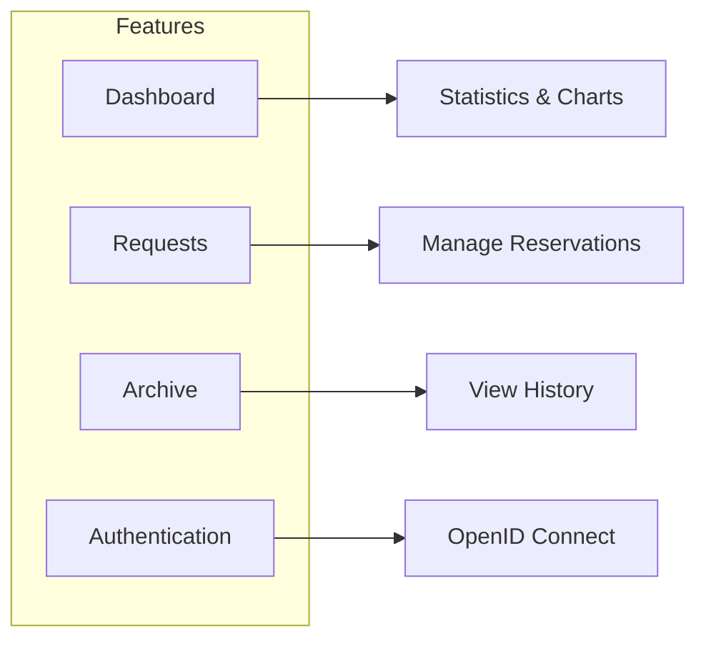
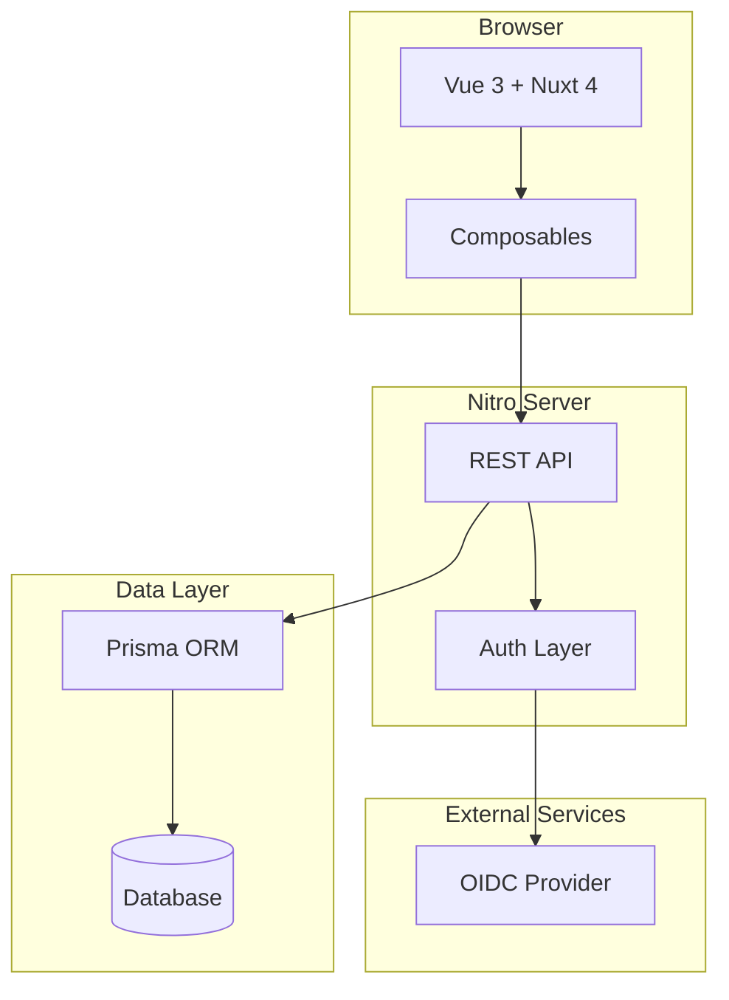

# OpenShift Partner Labs Dashboard

A modern web application for managing OpenShift cluster reservation requests across partner organizations. Built with Nuxt 4, Vue 3, and Tailwind CSS.



## Quick Start

```bash
# Install dependencies
pnpm install

# Set up environment
cp .env.example .env
# Edit .env with your credentials

# Generate Prisma client for SQLite (local development)
pnpm prisma generate

# Run database migrations and seed
pnpm db:migrate
pnpm db:seed

# Start development server
pnpm dev
```

Open [http://localhost:3000](http://localhost:3000) in your browser.

> **Note**: Local development uses SQLite by default. See [Database documentation](./docs/database.md) for PostgreSQL production setup.

## Tech Stack

| Category | Technology |
|----------|------------|
| **Framework** | Nuxt 4.3 (Vue 3.5) |
| **Language** | TypeScript 5.9 |
| **Styling** | Tailwind CSS + LightningCSS |
| **UI Components** | Shuriken UI + Tairo + Reka UI |
| **Database** | Prisma ORM (SQLite / PostgreSQL) |
| **Authentication** | OIDC + JWT |
| **Charts** | ECharts |
| **Icons** | Iconify (Phosphor, Lucide) |

## Features

- **Dashboard**: Real-time statistics, cost overview charts, labs summary
- **Request Management**: View, filter, search, and manage lab requests
- **Extensions**: Request reservation extensions with approval workflow
- **Notes**: Add and manage notes on requests
- **Archive**: View completed and denied requests
- **Company View**: Filter requests by partner organization
- **Multi-language**: English, French, Spanish, German, Arabic, Japanese
- **Dark Mode**: Full dark mode support
- **Idle Timeout**: Automatic session expiration for security

## Documentation

Comprehensive documentation is available in the [`docs/`](./docs) folder:

| Document | Description |
|----------|-------------|
| [User Guide](./docs/user-guide.md) | Complete guide for end users |
| [Developer Guide](./docs/developer-guide.md) | Setup, conventions, and development workflow |
| [API Reference](./docs/api-reference.md) | REST API documentation |
| [Architecture](./docs/architecture.md) | System architecture and design patterns |
| [Authentication](./docs/authentication.md) | OAuth flow and session management |
| [Database](./docs/database.md) | Schema, models, and Prisma usage |
| [Components](./docs/components.md) | UI component reference |

## Project Structure

```
portal/
├── app/                    # Main application code
│   ├── pages/             # File-based routing
│   ├── components/        # Vue components
│   ├── composables/       # Reusable logic
│   ├── layouts/           # Page layouts
│   ├── middleware/        # Route guards
│   └── plugins/           # App initialization
├── server/                # Server-side code
│   ├── api/              # API endpoints
│   └── utils/            # Server utilities
├── layers/tairo/         # Tairo UI layer
├── prisma/               # Database schema
├── i18n/                 # Translations
├── docs/                 # Documentation
└── public/               # Static assets
```

## Commands

| Command | Description |
|---------|-------------|
| `pnpm dev` | Start development server |
| `pnpm build` | Build for production |
| `pnpm preview` | Preview production build |
| `pnpm typecheck` | Run TypeScript checker |
| `pnpm db:migrate` | Run database migrations |
| `pnpm db:seed` | Seed database |
| `pnpm db:studio` | Open Prisma Studio |

## Environment Variables

```env
# Required - OIDC Provider
OAUTH_CLIENT_ID=your-oidc-client-id
OAUTH_CLIENT_SECRET=your-oidc-client-secret
OAUTH_AUTH_URL=https://your-provider.com/auth
OAUTH_TOKEN_URL=https://your-provider.com/token
AUTH_SECRET=your-secure-secret

# Application
APP_URL=http://localhost:3000
NUXT_PUBLIC_SITE_URL=http://localhost:3000

# Optional
NUXT_PUBLIC_MAPBOX_TOKEN=your-mapbox-token
```

## Architecture



## Contributing

1. Create a feature branch from `main`
2. Follow the coding conventions in [CLAUDE.md](./CLAUDE.md)
3. Write tests for new features
4. Submit a pull request

## License

Private - All rights reserved.
