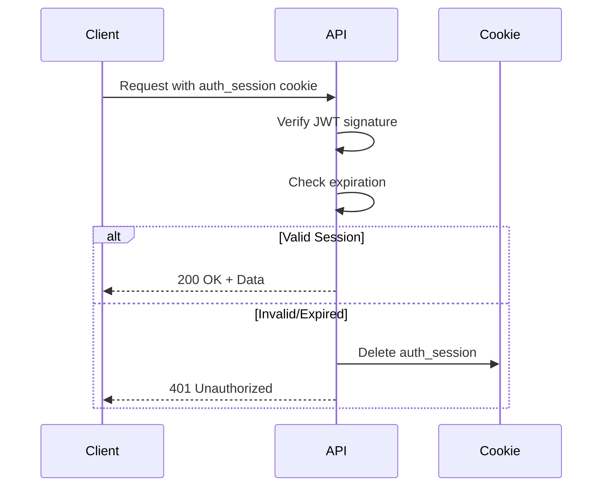
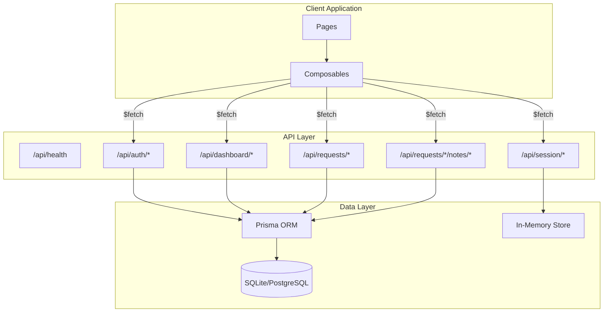

# API Reference

> Complete API documentation for the OpenShift Partner Labs Dashboard

## Table of Contents

1. [Overview](#overview)
2. [Authentication](#authentication)
3. [Error Handling](#error-handling)
4. [Health Endpoint](#health-endpoint)
5. [Authentication Endpoints](#authentication-endpoints)
6. [Session Endpoints](#session-endpoints)
7. [Dashboard Endpoints](#dashboard-endpoints)
8. [Request Endpoints](#request-endpoints)
9. [Notes Endpoints](#notes-endpoints)

## Overview

### Base URL

```
http://localhost:3000/api     # Development
https://your-domain.com/api   # Production
```

### Request Format

All API requests should include:
- `Content-Type: application/json` for POST/PATCH requests
- Session cookie (automatically sent by browser)

### Response Format

All responses are JSON with consistent structure:

**Success Response:**
```json
{
  "data": { ... }
}
```

**Error Response:**
```json
{
  "statusCode": 400,
  "statusMessage": "Bad Request",
  "message": "Detailed error message"
}
```

## Authentication

All API endpoints (except `/api/auth/callback`) require authentication via an HTTPOnly cookie named `auth_session`.

### Session Flow



## Error Handling

### HTTP Status Codes

| Code | Meaning |
|------|---------|
| 200 | Success |
| 400 | Bad Request - Invalid input |
| 401 | Unauthorized - Not authenticated |
| 403 | Forbidden - Insufficient permissions |
| 404 | Not Found - Resource doesn't exist |
| 500 | Server Error |

### Error Response Structure

```typescript
interface ErrorResponse {
  statusCode: number
  statusMessage: string
  message: string
  data?: {
    fieldErrors?: Record<string, string[]>
    formErrors?: string[]
  }
}
```

---

## Health Endpoint

### GET /api/health

Health check endpoint for monitoring and load balancers.

**Request:**
```http
GET /api/health
```

**Response (200):**
```json
{
  "status": "ok",
  "timestamp": "2026-02-26T12:00:00.000Z"
}
```

**Notes:**
- Does not require authentication
- Used by Kubernetes/OpenShift readiness probes
- Returns current server timestamp

---

## Authentication Endpoints

### GET /api/auth/callback

OAuth callback endpoint for Google authentication.

**Query Parameters:**

| Parameter | Type | Description |
|-----------|------|-------------|
| `code` | string | Authorization code from Google |
| `state` | string | Base64-encoded state object |
| `error` | string | Error code if auth failed |

**State Object Structure:**
```json
{
  "nonce": "random-string",
  "returnUrl": "/dashboard"
}
```

**Responses:**

| Status | Description |
|--------|-------------|
| 302 | Redirect to returnUrl on success |
| 302 | Redirect to `/auth?error=...` on failure |

---

### GET /api/auth/me

Get current authenticated user information.

**Request:**
```http
GET /api/auth/me
Cookie: auth_session=<jwt-token>
```

**Success Response (200):**
```json
{
  "sub": "123456789",
  "email": "user@example.com",
  "name": "John Doe",
  "picture": "https://lh3.googleusercontent.com/...",
  "canEdit": true
}
```

**Error Response (401):**
```json
{
  "statusCode": 401,
  "message": "Unauthorized"
}
```

---

### POST /api/auth/logout

End the current session.

**Request:**
```http
POST /api/auth/logout
Cookie: auth_session=<jwt-token>
```

**Response (200):**
```json
{
  "message": "Logged out successfully"
}
```

**Side Effect:** Deletes the `auth_session` cookie.

---

## Session Endpoints

The session endpoints provide an in-memory data store for user-specific session data that persists for the duration of the server process.

### POST /api/session/init

Initialize session data for the current user.

**Request:**
```http
POST /api/session/init
Cookie: auth_session=<jwt-token>
```

**Response (200):**
```json
{
  "initializedAt": 1708948800000
}
```

**Behavior:**
- Returns existing session data if already initialized
- Creates new session data if not present
- Session data is stored in-memory on the server
- Data is lost on server restart

---

### GET /api/session/data

Retrieve session data for the current user.

**Request:**
```http
GET /api/session/data
Cookie: auth_session=<jwt-token>
```

**Response (200):**
```json
{
  "initializedAt": 1708948800000
}
```

**Response (200) - No session data:**
```json
null
```

**Notes:**
- Returns `null` if session not initialized
- Only returns client-safe data (sensitive data is kept server-side only)

---

## Dashboard Endpoints

### GET /api/dashboard/stats

Get dashboard statistics.

**Request:**
```http
GET /api/dashboard/stats
Cookie: auth_session=<jwt-token>
```

**Response (200):**
```json
{
  "totalLabs": 150,
  "activeLabs": 42,
  "deniedLabs": 15,
  "completedLabs": 93
}
```

---

### GET /api/dashboard/cost-overview

Get cost overview data for charts.

**Request:**
```http
GET /api/dashboard/cost-overview
Cookie: auth_session=<jwt-token>
```

**Response (200):**
```json
{
  "thisYear": [45, 52, 48, 55, 60, 58],
  "lastYear": [40, 45, 42, 50, 52, 48],
  "months": ["Sep", "Oct", "Nov", "Dec", "Jan", "Feb"]
}
```

---

### GET /api/dashboard/labs-summary

Get labs creation/completion summary for charts.

**Request:**
```http
GET /api/dashboard/labs-summary
Cookie: auth_session=<jwt-token>
```

**Response (200):**
```json
{
  "created": [15, 20, 18, 22, 25, 19],
  "completed": [12, 16, 14, 18, 20, 15],
  "totalCreated": 119,
  "totalCompleted": 95,
  "months": ["Jan", "Feb", "Mar", "Apr", "May", "Jun"]
}
```

---

### GET /api/dashboard/companies

Get list of partner companies.

**Request:**
```http
GET /api/dashboard/companies
Cookie: auth_session=<jwt-token>
```

**Response (200):**
```json
[
  {
    "id": 1,
    "name": "Acme Corporation",
    "logoUrl": "https://example.com/logo.png"
  },
  {
    "id": 2,
    "name": "Tech Partners Inc",
    "logoUrl": null
  }
]
```

---

## Request Endpoints

### GET /api/requests

Get list of active requests.

**Request:**
```http
GET /api/requests
Cookie: auth_session=<jwt-token>
```

**Query Parameters:**

| Parameter | Type | Description |
|-----------|------|-------------|
| `status` | string | Filter by status (optional) |
| `archived` | boolean | Include archived requests (default: false) |

**Response (200):**
```json
[
  {
    "id": 1,
    "cluster": "partner-lab-abc123",
    "company": {
      "id": 1,
      "name": "Acme Corporation",
      "logoUrl": "https://example.com/logo.png"
    },
    "timezone": "America/New_York",
    "status": "Running",
    "startDate": "2024-01-15T00:00:00.000Z",
    "endDate": "2024-02-15T00:00:00.000Z",
    "notesCount": 3
  }
]
```

---

### GET /api/requests/:id

Get detailed information for a single request.

**Request:**
```http
GET /api/requests/123
Cookie: auth_session=<jwt-token>
```

**Response (200):**
```json
{
  "id": 123,
  "cluster": "partner-lab-abc123",
  "company": {
    "id": 1,
    "name": "Acme Corporation",
    "logoUrl": "https://example.com/logo.png"
  },
  "timezone": "America/New_York",
  "status": "Running",
  "startDate": "2024-01-15T00:00:00.000Z",
  "endDate": "2024-02-15T00:00:00.000Z",
  "createdAt": "2024-01-10T10:30:00.000Z",
  "updatedAt": "2024-01-20T14:45:00.000Z",
  "openshiftVersion": "4.14",
  "requestType": "Partner Lab",
  "leaseTime": "30 days",
  "description": "Lab for testing new features",
  "sponsor": "John Smith",
  "primaryContact": {
    "firstName": "Jane",
    "lastName": "Doe",
    "email": "jane.doe@acme.com"
  },
  "secondaryContact": {
    "firstName": "Bob",
    "lastName": "Wilson",
    "email": "bob.wilson@acme.com"
  },
  "notes": [
    {
      "id": 1,
      "content": "Initial setup completed",
      "author": {
        "id": "user@example.com",
        "name": "Admin User",
        "picture": "https://..."
      },
      "immutable": false,
      "createdAt": "2024-01-15T10:00:00.000Z"
    }
  ],
  "extensionHistory": [
    {
      "id": 1,
      "extension": "1w",
      "requestedBy": "jane.doe@acme.com",
      "date": "2024-02-01T00:00:00.000Z",
      "status": "Approved",
      "createdAt": "2024-02-01T09:00:00.000Z"
    }
  ],
  "clusterLogins": [
    {
      "id": 1,
      "loginName": "admin",
      "loginType": "ssh",
      "accessTime": "2024-01-16T08:30:00.000Z"
    }
  ]
}
```

**Error Response (404):**
```json
{
  "statusCode": 404,
  "message": "Request not found"
}
```

---

### PATCH /api/requests/:id

Update a request (requires edit permissions).

**Request:**
```http
PATCH /api/requests/123
Cookie: auth_session=<jwt-token>
Content-Type: application/json

{
  "status": "Completed",
  "endDate": "2024-02-20T00:00:00.000Z"
}
```

**Request Body:**

| Field | Type | Description |
|-------|------|-------------|
| `status` | string | New status value |
| `endDate` | string | New end date (ISO 8601) |
| `description` | string | Updated description |

**Response (200):**
```json
{
  "id": 123,
  "status": "Completed",
  "endDate": "2024-02-20T00:00:00.000Z",
  "updatedAt": "2024-02-15T16:00:00.000Z"
}
```

---

### POST /api/requests/:id/extend

Request an extension for a lab.

**Request:**
```http
POST /api/requests/123/extend
Cookie: auth_session=<jwt-token>
Content-Type: application/json

{
  "duration": "1w"
}
```

**Request Body:**

| Field | Type | Values | Description |
|-------|------|--------|-------------|
| `duration` | string | `3d`, `1w`, `2w`, `1mo` | Extension duration |

**Response (200):**
```json
{
  "id": 5,
  "labId": 123,
  "extension": "1w",
  "currentUser": "user@example.com",
  "status": "Pending",
  "date": "2024-02-15T00:00:00.000Z",
  "createdAt": "2024-02-15T10:30:00.000Z"
}
```

**Error Response (400):**
```json
{
  "statusCode": 400,
  "message": "Invalid duration. Must be one of: 3d, 1w, 2w, 1mo"
}
```

---

## Notes Endpoints

### POST /api/requests/:id/notes

Add a note to a request.

**Request:**
```http
POST /api/requests/123/notes
Cookie: auth_session=<jwt-token>
Content-Type: application/json

{
  "content": "Cluster is performing well after latest update"
}
```

**Request Body:**

| Field | Type | Description |
|-------|------|-------------|
| `content` | string | Note content (required, min 1 char) |

**Response (201):**
```json
{
  "id": 10,
  "labId": 123,
  "userId": "user@example.com",
  "note": "Cluster is performing well after latest update",
  "immutable": false,
  "createdAt": "2024-02-15T11:00:00.000Z"
}
```

---

### PATCH /api/requests/:id/notes/:noteId

Update an existing note (if not immutable).

**Request:**
```http
PATCH /api/requests/123/notes/10
Cookie: auth_session=<jwt-token>
Content-Type: application/json

{
  "content": "Updated note content"
}
```

**Response (200):**
```json
{
  "id": 10,
  "note": "Updated note content",
  "updatedAt": "2024-02-15T11:30:00.000Z"
}
```

**Error Response (403):**
```json
{
  "statusCode": 403,
  "message": "Cannot modify immutable note"
}
```

---

## Data Flow Diagram



---

## Rate Limiting

Currently, no rate limiting is implemented. For production deployments, consider adding rate limiting via:
- Reverse proxy (nginx, Cloudflare)
- Middleware (nuxt-rate-limit)

## Versioning

The API is currently unversioned. Future breaking changes may introduce versioning:
- Header: `Accept: application/vnd.opl.v2+json`
- Path: `/api/v2/requests`

---

**Related Documentation**:
- [Architecture](architecture.md) - System architecture
- [Authentication](authentication.md) - Auth flow details
- [Developer Guide](developer-guide.md) - Development setup
