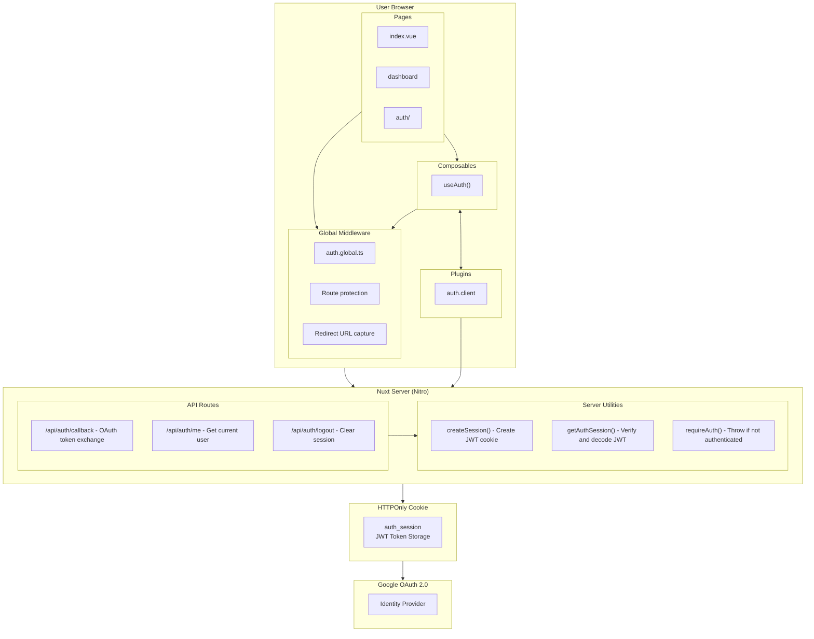
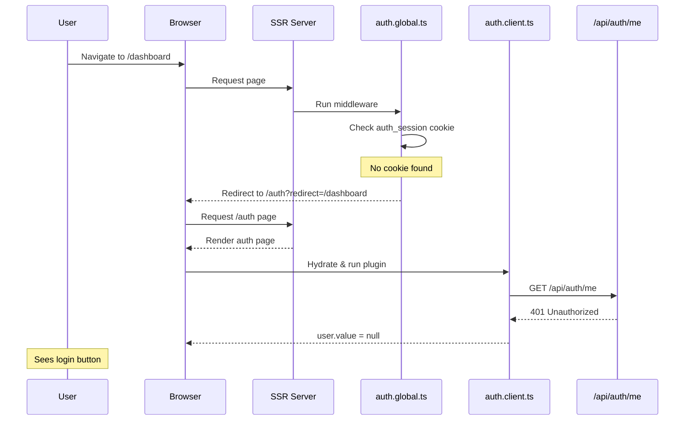
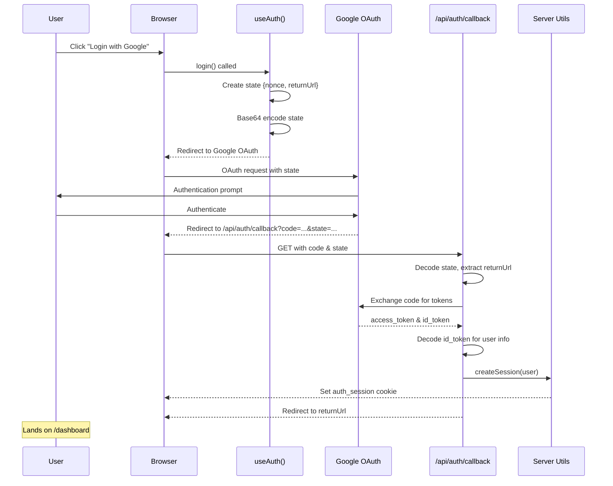
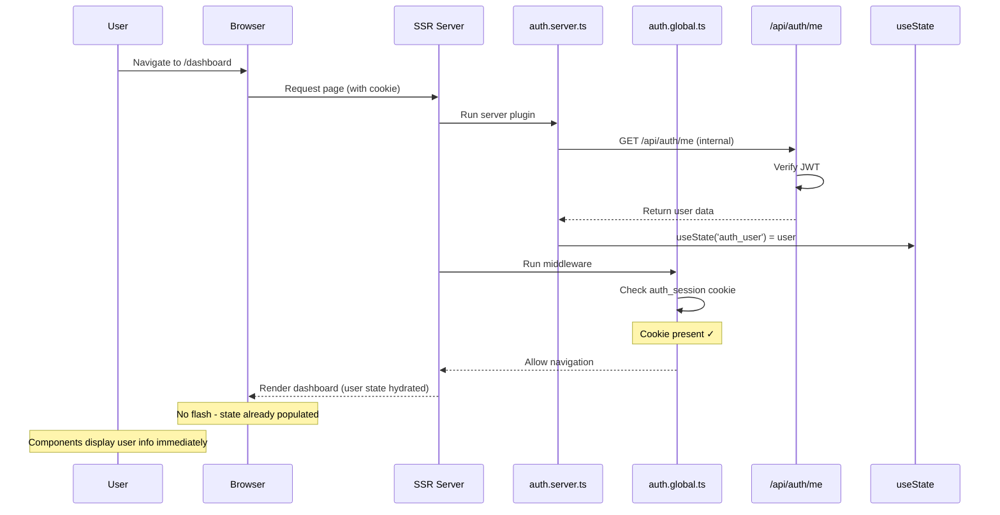
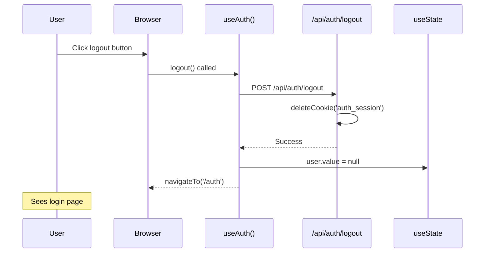
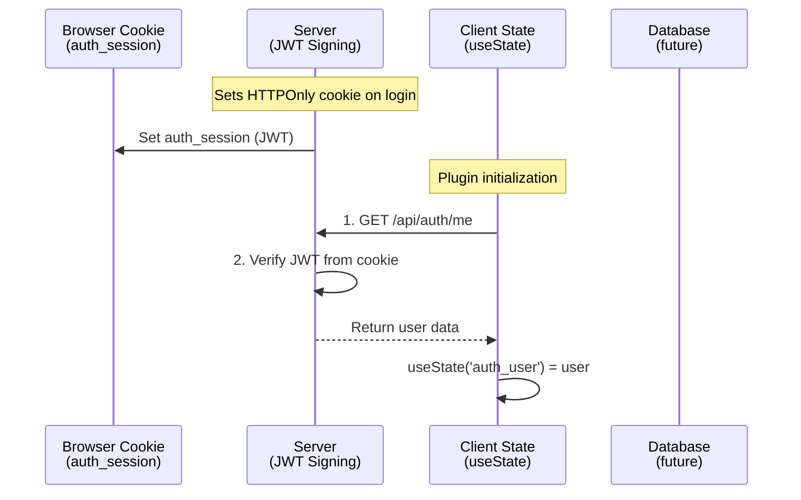

# System Architecture

> Comprehensive guide to the application architecture, design patterns, and technical decisions

## Table of Contents

1. [Overview](#overview)
2. [Architecture Diagram](#architecture-diagram)
3. [Request Lifecycle](#request-lifecycle)
4. [State Management](#state-management)
5. [File Organization](#file-organization)
6. [Design Patterns](#design-patterns)
7. [Technology Choices](#technology-choices)

## Overview

This application follows a **server-first architecture** with client-side hydration, built on Nuxt 4's modern file-based conventions. Authentication is handled server-side with JWT sessions, while client state is synchronized for reactive UI updates.

### Key Architectural Principles

1. **Server Authority**: Server is the single source of truth for authentication
2. **Progressive Enhancement**: Works without JavaScript, enhanced with it
3. **Security by Default**: HTTPOnly cookies, CSRF protection, validation at boundaries
4. **Incremental Adoption**: Start simple, add complexity as needed
5. **Type Safety**: TypeScript everywhere with strict checks

## Architecture Diagram



## Request Lifecycle

### 1. Initial Page Load (Unauthenticated)



### 2. OAuth Login Flow



### 3. Protected Page Access (Authenticated)



### 4. Logout Flow



## State Management

### Server-Side State

**Storage**: HTTPOnly cookie named `auth_session`

**Contents**: JWT containing:
```typescript
{
  sub: string,      // Google user ID
  email: string,    // User email
  name: string,     // Display name
  picture: string,  // Profile picture URL
  exp: number       // Expiration timestamp
}
```

**Characteristics**:
- Not accessible via JavaScript (HTTPOnly)
- Signed with AUTH_SECRET (prevents tampering)
- Expires after 7 days
- SameSite: 'lax' (CSRF protection)
- Secure flag in production

### Client-Side State

**Storage**: Vue's `useState('auth_user')`

**Contents**: User object (without exp/iat):
```typescript
{
  sub: string,
  email: string,
  name: string,
  picture: string
}
```

**Characteristics**:
- Reactive (triggers component updates)
- Initialized on app mount
- Synchronized from server session
- Cleared on logout
- Not persisted (rehydrates from cookie)

### State Synchronization



**Synchronization Points**:
1. **App Mount**: Plugin calls `/api/auth/me` to populate client state
2. **Login**: Server creates cookie, client state updated on next request
3. **Logout**: Server deletes cookie, client state cleared immediately
4. **Page Refresh**: Plugin re-fetches user data from server

## File Organization

### Directory Structure Philosophy

```
app/                    # Client-side application code
├── pages/             # File-based routes (auto-generates routes)
├── layouts/           # Shared page layouts
├── middleware/        # Route guards (global & page-specific)
├── composables/       # Reusable stateful logic
├── plugins/           # App initialization & global setup
└── assets/            # Build-time assets (CSS, images)

server/                # Server-side code
├── api/              # API endpoints (auto-registered routes)
└── utils/            # Server-only utilities

layers/tairo/         # Extended Tairo UI layer
├── components/       # Tairo components
├── composables/      # Tairo composables
├── plugins/          # Tairo plugins
└── utils/            # Tairo utilities
```

### Naming Conventions

**Pages** (File-based routing):
- `pages/index.vue` → `/`
- `pages/dashboard.vue` → `/dashboard`
- `pages/auth/index.vue` → `/auth`
- `pages/user/[id].vue` → `/user/:id` (dynamic)

**API Routes**:
- `server/api/auth/me.get.ts` → `GET /api/auth/me`
- `server/api/auth/logout.post.ts` → `POST /api/auth/logout`
- `server/api/users/[id].get.ts` → `GET /api/users/:id`

**Composables** (Auto-imported):
- `composables/useAuth.ts` → `useAuth()`
- Must start with `use` prefix
- Exported as named or default export

**Middleware**:
- `middleware/auth.global.ts` → Runs on every route
- `middleware/admin.ts` → Use with `definePageMeta({ middleware: 'admin' })`

## Design Patterns

### 1. Composables Pattern (State Management)

**Purpose**: Share stateful logic across components

**Example**: `useAuth()` composable
```typescript
export const useAuth = () => {
  // Shared state (singleton per app)
  const user = useState<User | null>('auth_user', () => null)

  // Shared methods
  const init = async () => { /* ... */ }
  const login = () => { /* ... */ }
  const logout = async () => { /* ... */ }

  return { user, init, login, logout }
}
```

**Usage**:
```vue
<script setup>
const { user, logout } = useAuth()
</script>

<template>
  <div v-if="user">
    Hello {{ user.name }}
    <button @click="logout">Logout</button>
  </div>
</template>
```

**Benefits**:
- Type-safe
- Auto-imported
- Reactive
- Testable
- Reusable

### 2. Global Middleware Pattern (Route Guards)

**Purpose**: Protect routes before rendering

**Example**: `auth.global.ts`
```typescript
export default defineNuxtRouteMiddleware(async (to) => {
  // Skip for API auth callbacks
  if (to.path.startsWith('/api/auth/callback')) {
    return
  }

  const { user, init } = useAuth()

  // On client side, ensure user is initialized before checking auth
  if (process.client) {
    await init()
  }

  // Check authentication: on server use cookie, on client use user state
  const isAuthenticated = process.server
    ? !!useCookie('auth_session').value
    : !!user.value

  // If user is authenticated and visiting auth page, redirect to dashboard
  if (to.path.startsWith('/auth')) {
    if (isAuthenticated) {
      return navigateTo('/dashboard')
    }
    return
  }

  // Home page: redirect based on auth status
  if (to.path === '/') {
    return navigateTo(isAuthenticated ? '/dashboard' : '/auth')
  }

  // For all other routes, require authentication
  if (!isAuthenticated) {
    return navigateTo(`/auth?redirect=${encodeURIComponent(to.fullPath)}`)
  }
})
```

**Execution**:
- Runs on **every navigation** (SSR & client)
- Runs **before** page component renders
- Can redirect, abort, or allow navigation
- Suffix `.global.ts` for automatic registration
- Handles server/client auth checks differently (cookie vs user state)
- Initializes user state on client before checking auth

### 3. Server Utilities Pattern (Shared Logic)

**Purpose**: Reuse logic across API routes

**Example**: `server/utils/auth.ts`
```typescript
export const requireAuth = (event: H3Event): SessionPayload => {
  const session = getAuthSession(event)
  if (!session) {
    throw createError({ statusCode: 401, message: 'Unauthorized' })
  }
  return session
}
```

**Usage**:
```typescript
// server/api/protected-data.get.ts
export default defineEventHandler((event) => {
  const user = requireAuth(event) // Throws 401 if not authenticated
  return { data: 'secret', user }
})
```

### 4. Plugin Pattern (App Initialization)

**Purpose**: Run code on app startup

**Example**: `auth.server.ts` (SSR hydration)
```typescript
export default defineNuxtPlugin(async (nuxtApp) => {
  const user = useState('auth_user', () => null)
  if (user.value) return

  const token = useCookie('auth_session')
  if (!token.value) return

  try {
    const requestFetch = useRequestFetch()
    user.value = await requestFetch('/api/auth/me')
  } catch {
    user.value = null
  }
})
```

**Example**: `auth.client.ts` (client fallback)
```typescript
export default defineNuxtPlugin(async () => {
  const { user, init } = useAuth()
  if (user.value) return // Already hydrated from SSR
  await init()
})
```

**Example**: `session.client.ts` (session data initialization)
```typescript
export default defineNuxtPlugin(async () => {
  const { user } = useAuth()
  const sessionData = useState('session_data', () => null)

  if (!user.value) return
  if (sessionData.value) return

  try {
    const data = await $fetch('/api/session/init', { method: 'POST' })
    sessionData.value = data
  } catch {
    sessionData.value = null
  }
})
```

**Types**:
- `.server.ts` - Server-side only (SSR)
- `.client.ts` - Client-side only (browser)
- `.ts` - Universal (both)

### 5. Layout Pattern (UI Structure)

**Purpose**: Share UI structure across pages

**Example**:
```vue
<!-- layouts/empty.vue -->
<template>
  <div>
    <slot /> <!-- Page content goes here -->
  </div>
</template>
```

**Usage**:
```vue
<script setup>
definePageMeta({
  layout: 'empty'
})
</script>
```

## Technology Choices

### Why Nuxt 4?

**Chosen for**:
- File-based routing (convention over configuration)
- Auto-imports (components, composables, utilities)
- SSR & hydration out of the box
- Built-in TypeScript support
- Nitro server (unified API)
- Vue 3 Composition API

**Alternatives considered**:
- Next.js (React) - Not Vue
- SvelteKit - Smaller ecosystem
- Vanilla Vite + Vue - Too much manual setup

### Why JWT in HTTPOnly Cookies?

**Chosen for**:
- Not accessible via JavaScript (XSS protection)
- Automatically sent with requests
- Server-side verification
- Stateless sessions

**Alternatives considered**:
- LocalStorage + Bearer tokens - Vulnerable to XSS
- Server-side sessions + Redis - More infrastructure
- Refresh token rotation - Over-engineering for MVP

### Why Google OAuth?

**Chosen for**:
- No password management
- Trusted identity provider
- Built-in MFA support
- User profile data included

**Alternatives considered**:
- Email/password - Requires password reset, email verification
- Magic links - Email deliverability issues
- Passkeys - Browser support still limited

### Why LightningCSS?

**Chosen for**:
- 100x faster than PostCSS
- Rust-based (native performance)
- Tailwind CSS compatible
- Smaller bundle sizes

**Alternatives considered**:
- PostCSS - Slower in development
- UnoCSS - Different ecosystem

### Why Vee-Validate + Zod?

**Chosen for**:
- Type-safe schema validation
- Reusable schemas (client & server)
- Great TypeScript inference
- Composition API support

**Alternatives considered**:
- Yup - Older, less TypeScript support
- Manual validation - Error-prone

## Architectural Decisions

### Decision: Server-First Authentication

**Context**: Need to authenticate users securely

**Decision**: Use server-side JWT sessions in HTTPOnly cookies

**Rationale**:
- Prevents XSS attacks (tokens not accessible to JavaScript)
- Simplifies client code (no token management)
- SSR-compatible (works without JavaScript)
- Aligns with Nuxt's server-first philosophy

**Consequences**:
- ✅ Better security posture
- ✅ Simpler client code
- ❌ Requires server on every request
- ❌ Cannot work fully offline

### Decision: Return URL via OAuth State

**Context**: Need to redirect users to intended page after login

**Decision**: Encode return URL in OAuth state parameter

**Rationale**:
- Standard OAuth pattern
- Survives external redirect to Google
- Can include CSRF nonce
- More secure than query parameters

**Consequences**:
- ✅ Preserves user intent
- ✅ Adds CSRF protection
- ✅ No server-side state needed
- ❌ Limited to ~2KB of data

### Decision: Global Middleware for Auth

**Context**: Need to protect multiple routes

**Decision**: Use global middleware instead of per-page meta

**Rationale**:
- Default-secure (new routes protected by default)
- Single source of truth
- Easier to audit
- Works for dynamic routes

**Consequences**:
- ✅ Security by default
- ✅ DRY (don't repeat yourself)
- ❌ Must maintain public routes list
- ❌ Cannot easily vary protection logic per route

### Decision: Client State Hydration

**Context**: Need reactive auth state for UI

**Decision**: Hydrate client state during SSR via server plugin

**Rationale**:
- Reactive updates (Vue's reactivity system)
- Works with SSR (server renders, client hydrates)
- Server plugin (`auth.server.ts`) populates state during SSR
- Client plugin (`auth.client.ts`) handles edge cases (e.g., session expiry)
- No flash of unauthenticated content

**Consequences**:
- ✅ Reactive UI updates
- ✅ SSR-compatible
- ✅ No flash of unauthenticated content (state hydrated during SSR)
- ❌ Initial API call on every page load (during SSR)

---

**Next**: Read [AUTHENTICATION.md](authentication.md) for detailed auth flow
