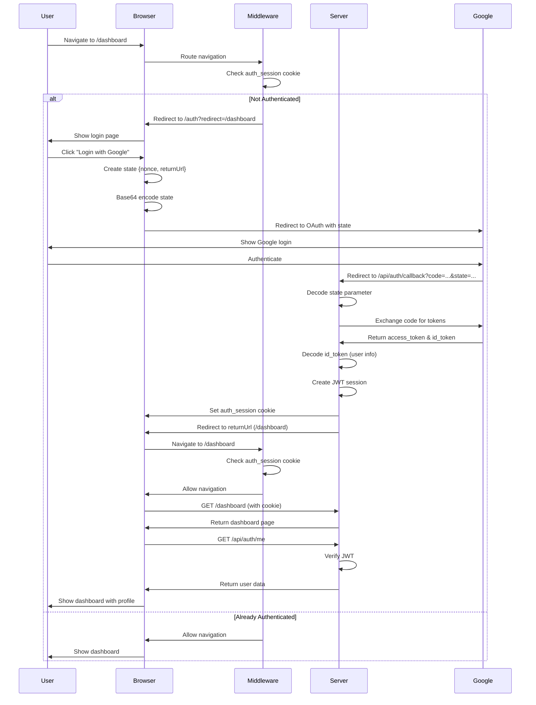

# Authentication System

> Deep dive into the OAuth authentication flow, session management, and security implementation

## Table of Contents

1. [Overview](#overview)
2. [Authentication Flow](#authentication-flow)
3. [Component Breakdown](#component-breakdown)
4. [Session Management](#session-management)
5. [Return URL Mechanism](#return-url-mechanism)
6. [Error Handling](#error-handling)
7. [Code Examples](#code-examples)

## Overview

The authentication system uses **Google OAuth 2.0** with server-side JWT sessions stored in HTTPOnly cookies. The implementation prioritizes security while maintaining a seamless user experience with intelligent redirect handling.

### Key Components

| Component | Location | Purpose |
|-----------|----------|---------|
| Login Page | `app/pages/auth/index.vue` | OAuth initiation |
| Auth Composable | `app/composables/useAuth.ts` | Client-side auth state |
| Auth Middleware | `app/middleware/auth.global.ts` | Route protection |
| OAuth Callback | `server/api/auth/callback.get.ts` | Token exchange |
| Me Endpoint | `server/api/auth/me.get.ts` | User info retrieval |
| Logout Endpoint | `server/api/auth/logout.post.ts` | Session termination |
| Auth Utilities | `server/utils/auth.ts` | Session management |
| Auth Plugin | `app/plugins/auth.client.ts` | State hydration |

## Authentication Flow

### Complete Flow Diagram



### Step-by-Step Breakdown

#### Step 1: Protected Route Access

**What happens**: User tries to access `/dashboard` without authentication

```typescript
// app/middleware/auth.global.ts
export default defineNuxtRouteMiddleware(async (to) => {
  // Skip for API auth callbacks
  if (to.path.startsWith('/api/auth/callback')) {
    return
  }

  const { user, init } = useAuth()

  // On client side, ensure user is initialized before checking auth
  if (process.client) {
    await init()
  }

  // Check authentication: on server use cookie, on client use user state
  const isAuthenticated = process.server
    ? !!useCookie('auth_session').value
    : !!user.value

  // If user is authenticated and visiting auth page, redirect to dashboard
  if (to.path.startsWith('/auth')) {
    if (isAuthenticated) {
      return navigateTo('/dashboard')
    }
    return
  }

  // Special handling for home page: redirect based on auth status
  if (to.path === '/') {
    if (isAuthenticated) {
      return navigateTo('/dashboard')
    } else {
      return navigateTo('/auth')
    }
  }

  // For all other routes, require authentication
  if (!isAuthenticated) {
    const redirectPath = to.fullPath
    return navigateTo(`/auth?redirect=${encodeURIComponent(redirectPath)}`)
  }
})
```

**Result**: Browser navigates to `/auth?redirect=%2Fdashboard`

#### Step 2: OAuth Initiation

**What happens**: User clicks "Login with Google" button

```typescript
// app/composables/useAuth.ts
const login = (returnUrl?: string) => {
  // Create state with CSRF nonce and return URL
  const state = {
    nonce: Math.random().toString(36).substring(2),
    returnUrl: returnUrl || '/dashboard'
  }

  // Base64 encode (browser-safe)
  const stateParam = btoa(JSON.stringify(state))

  const params = new URLSearchParams({
    client_id: config.public.googleClientId,
    redirect_uri: `${config.public.appUrl}/api/auth/callback`,
    response_type: 'code',
    scope: 'openid email profile',
    access_type: 'offline',  // Request refresh token
    prompt: 'consent',       // Force consent screen
    state: stateParam        // Our encoded state
  })

  navigateTo(`https://accounts.google.com/o/oauth2/v2/auth?${params}`, {
    external: true
  })
}
```

**URL Generated**:
```
https://accounts.google.com/o/oauth2/v2/auth?
  client_id=YOUR_CLIENT_ID&
  redirect_uri=http://localhost:3000/api/auth/callback&
  response_type=code&
  scope=openid+email+profile&
  access_type=offline&
  prompt=consent&
  state=eyJub25jZSI6ImFiYzEyMyIsInJldHVyblVybCI6Ii9kYXNoYm9hcmQifQ==
```

**Result**: Browser redirects to Google's OAuth consent screen

#### Step 3: Google Authentication

**What happens**: User authenticates with Google

- User enters credentials
- Google verifies identity
- User grants permissions (email, profile)
- Google generates authorization code

**Result**: Google redirects back to our callback URL

#### Step 4: OAuth Callback

**What happens**: Google redirects to `/api/auth/callback?code=...&state=...`

```typescript
// server/api/auth/callback.get.ts
export default defineEventHandler(async (event) => {
  const { code, error, state } = getQuery(event)

  // Handle OAuth errors
  if (error || !code) {
    return sendRedirect(event, '/auth?error=access_denied')
  }

  // Decode state to get return URL
  let returnUrl = '/dashboard'
  if (state && typeof state === 'string') {
    try {
      const stateData = JSON.parse(Buffer.from(state, 'base64').toString())
      // Validate returnUrl is relative (prevent open redirect)
      if (stateData.returnUrl && stateData.returnUrl.startsWith('/')) {
        returnUrl = stateData.returnUrl
      }
    } catch {
      returnUrl = '/dashboard'
    }
  }

  // Exchange authorization code for tokens
  const tokens = await $fetch('https://oauth2.googleapis.com/token', {
    method: 'POST',
    body: {
      code,
      client_id: config.public.googleClientId,
      client_secret: config.googleClientSecret,
      redirect_uri: `${config.public.appUrl}/api/auth/callback`,
      grant_type: 'authorization_code'
    }
  })

  // Decode id_token (JWT from Google, already verified)
  const payload = JSON.parse(
    Buffer.from(tokens.id_token.split('.')[1], 'base64').toString()
  )

  // Create our session
  createSession(event, {
    sub: payload.sub,
    email: payload.email,
    name: payload.name,
    picture: payload.picture
  })

  // Redirect to intended destination
  return sendRedirect(event, returnUrl)
})
```

**Result**:
- JWT session cookie created
- User redirected to `/dashboard`

#### Step 5: Session Creation

**What happens**: Server creates signed JWT and sets cookie

```typescript
// server/utils/auth.ts
export const createSession = (event, payload) => {
  const token = jwt.sign(payload, config.authSecret, {
    expiresIn: '7d'
  })

  setCookie(event, 'auth_session', token, {
    httpOnly: true,                          // Not accessible via JavaScript
    secure: process.env.NODE_ENV === 'production', // HTTPS only in prod
    sameSite: 'lax',                         // CSRF protection
    maxAge: 60 * 60 * 24 * 7,               // 7 days
    path: '/'                                // Available site-wide
  })
}
```

**Cookie Set**:
```
Set-Cookie: auth_session=eyJhbGciOiJIUzI1NiIs...;
  HttpOnly;
  SameSite=Lax;
  Max-Age=604800;
  Path=/
```

#### Step 6: Client Hydration

**What happens**: Page loads and plugin initializes auth state

```typescript
// app/plugins/auth.client.ts
export default defineNuxtPlugin(async () => {
  const { init } = useAuth()
  await init() // Fetch user data from server
})
```

```typescript
// app/composables/useAuth.ts
// Shared promise to prevent duplicate concurrent init calls
const initPromise = useState<Promise<void> | null>('auth_init_promise', () => null)

const init = async () => {
  if (user.value) return

  // If already initializing, wait for the existing promise
  if (initPromise.value) {
    return initPromise.value
  }

  // Create and store the promise
  initPromise.value = (async () => {
    try {
      const data = await $fetch<User>('/api/auth/me')
      user.value = data
    } catch {
      user.value = null
    } finally {
      initPromise.value = null
    }
  })()

  return initPromise.value
}
```

**API Call**:
```http
GET /api/auth/me
Cookie: auth_session=eyJhbGciOiJIUzI1NiIs...
```

**Server Response**:
```typescript
// server/api/auth/me.get.ts
export default defineEventHandler((event) => {
  const session = requireAuth(event) // Throws 401 if invalid
  return {
    sub: session.sub,
    email: session.email,
    name: session.name,
    picture: session.picture
  }
})
```

**Result**: Client state populated, UI reactive

## Component Breakdown

### 1. Login Page (`app/pages/auth/index.vue`)

**Responsibilities**:
- Display login UI
- Read redirect query parameter
- Initiate OAuth flow with return URL

**Key Code**:
```vue
<script setup lang="ts">
const route = useRoute()
const { login } = useAuth()

const handleGoogleLogin = () => {
  const redirectUrl = route.query.redirect as string | undefined
  login(redirectUrl)
}
</script>

<template>
  <button @click="handleGoogleLogin">
    <Icon name="logos:google-icon" />
    Login with Google
  </button>
</template>
```

### 2. Auth Composable (`app/composables/useAuth.ts`)

**Responsibilities**:
- Manage client-side auth state
- Provide login/logout methods
- Hydrate state from server

**Interface**:
```typescript
interface UseAuth {
  user: Ref<User | null>
  init: () => Promise<void>
  login: (returnUrl?: string) => void
  logout: () => Promise<void>
}
```

**State**:
```typescript
const user = useState<User | null>('auth_user', () => null)
```

### 3. Auth Middleware (`app/middleware/auth.global.ts`)

**Responsibilities**:
- Protect routes from unauthenticated access
- Capture intended destination
- Allow public routes

**Logic Flow**:
```
Is /api/auth/callback? → Yes → Allow
                       → No ↓
(Client) Initialize auth state
                       ↓
Is /auth page? → Yes → Is authenticated? → Yes → Redirect to /dashboard
                                         → No → Allow
             → No ↓
Is home (/)? → Yes → Is authenticated? → Yes → Redirect to /dashboard
                                       → No → Redirect to /auth
           → No ↓
Is authenticated? → Yes → Allow
                  → No → Redirect to /auth?redirect=...
```

### 4. OAuth Callback (`server/api/auth/callback.get.ts`)

**Responsibilities**:
- Handle OAuth redirect from Google
- Exchange code for tokens
- Extract user info from id_token
- Create session
- Redirect to return URL

**Error Cases**:
- `?error=access_denied` → User denied permissions
- `?error=token_exchange_failed` → Google API error

### 5. Auth Utilities (`server/utils/auth.ts`)

**Functions**:

```typescript
// Create session cookie with JWT
createSession(event: H3Event, payload: Omit<SessionPayload, 'exp'>): void

// Get session from cookie (returns null if invalid)
getAuthSession(event: H3Event): SessionPayload | null

// Require auth (throws 401 if not authenticated)
requireAuth(event: H3Event): SessionPayload
```

## Session Management

### JWT Structure

**Payload**:
```json
{
  "sub": "1234567890",
  "email": "user@example.com",
  "name": "John Doe",
  "picture": "https://lh3.googleusercontent.com/...",
  "iat": 1705440000,
  "exp": 1706044800
}
```

**Signature**: HMAC-SHA256 using `AUTH_SECRET`

### Session Verification

**Every API Request**:
```typescript
export const getAuthSession = (event: H3Event): SessionPayload | null => {
  const config = useRuntimeConfig()
  const token = getCookie(event, 'auth_session')

  if (!token) return null

  try {
    return jwt.verify(token, config.authSecret) as SessionPayload
  } catch {
    // expired or invalid
    deleteCookie(event, 'auth_session')
    return null
  }
}
```

**Verification Steps**:
1. Extract cookie value
2. Verify signature (prevents tampering)
3. Check expiration (auto-fails if expired)
4. Return payload or null

### Session Lifecycle

```
┌─────────────────────────────────────────────────────────┐
│                   Session Lifecycle                      │
└─────────────────────────────────────────────────────────┘

Login
  ↓
[Create] JWT signed, cookie set (7d expiration)
  ↓
[Active] Cookie sent with every request
  ↓
[Verify] Server validates on each API call
  ↓
[Refresh] User activity extends session (future: refresh tokens)
  ↓
[Expire] After 7 days or manual logout
  ↓
[Cleanup] Cookie deleted, client state cleared
```

## Return URL Mechanism

### Why State Parameter?

**Problem**: After OAuth redirect to Google and back, we need to remember where the user was going.

**Solution**: Encode destination in OAuth `state` parameter.

**Benefits**:
- Survives external redirect
- Standard OAuth pattern
- Can include CSRF nonce
- No server-side storage needed

### State Object Structure

```typescript
interface OAuthState {
  nonce: string      // Random CSRF token
  returnUrl: string  // Where to redirect after login
}
```

### Encoding/Decoding

**Client (Browser)**:
```typescript
// Encode
const state = { nonce: 'abc123', returnUrl: '/dashboard' }
const encoded = btoa(JSON.stringify(state))
// Result: eyJub25jZSI6ImFiYzEyMyIsInJldHVyblVybCI6Ii9kYXNoYm9hcmQifQ==
```

**Server (Node.js)**:
```typescript
// Decode
const decoded = Buffer.from(state, 'base64').toString()
const stateData = JSON.parse(decoded)
// Result: { nonce: 'abc123', returnUrl: '/dashboard' }
```

### Security Validation

```typescript
// Validate returnUrl is relative (prevent open redirect)
if (stateData.returnUrl && stateData.returnUrl.startsWith('/')) {
  returnUrl = stateData.returnUrl
} else {
  returnUrl = '/dashboard' // Safe default
}
```

**Blocked Examples**:
- `http://evil.com` ❌
- `//evil.com` ❌
- `https://phishing.com` ❌

**Allowed Examples**:
- `/dashboard` ✅
- `/user/profile` ✅
- `/admin?tab=settings` ✅

## Error Handling

### OAuth Errors

**User Denies Permissions**:
```
Google → /api/auth/callback?error=access_denied
         ↓
         Redirect to /auth?error=access_denied
```

**Token Exchange Fails**:
```
POST https://oauth2.googleapis.com/token → 400 Bad Request
         ↓
         Redirect to /auth?error=token_exchange_failed
```

### Session Errors

**Expired JWT**:
```
jwt.verify(token) → JsonWebTokenError
         ↓
         Delete cookie
         ↓
         Return null (treated as not authenticated)
```

**Invalid Signature**:
```
jwt.verify(token) → JsonWebTokenError
         ↓
         Delete cookie (token was tampered with)
         ↓
         Return null
```

### Network Errors

**API Call Fails**:
```vue
<script setup>
const { init } = useAuth()

try {
  await init()
} catch (error) {
  // Silent fail - user treated as not authenticated
  user.value = null
}
</script>
```

## Code Examples

### Protecting a New Page

```vue
<!-- app/pages/admin.vue -->
<script setup lang="ts">
// No special code needed - global middleware handles it!
const { user } = useAuth()
</script>

<template>
  <div>
    <h1>Admin Panel</h1>
    <p>Welcome, {{ user?.name }}</p>
  </div>
</template>
```

### Protecting an API Endpoint

```typescript
// server/api/admin/users.get.ts
export default defineEventHandler((event) => {
  // Throws 401 if not authenticated
  const session = requireAuth(event)

  // Your logic here
  return { users: [], requestedBy: session.email }
})
```

### Accessing User Info in Component

```vue
<script setup lang="ts">
const { user } = useAuth()
</script>

<template>
  <div v-if="user">
    
    <span>{{ user.email }}</span>
  </div>
  <div v-else>
    <a href="/auth">Login</a>
  </div>
</template>
```

### Custom Logout Logic

```vue
<script setup lang="ts">
const { logout } = useAuth()
const router = useRouter()

const handleLogout = async () => {
  // Show confirmation
  if (!confirm('Are you sure you want to logout?')) {
    return
  }

  // Perform logout
  await logout()

  // Custom redirect (default is /auth)
  router.push('/')
}
</script>
```

### Making Authenticated API Calls

```typescript
// Client-side
const data = await $fetch('/api/protected-data')
// Cookie automatically sent!

// Server-side endpoint
export default defineEventHandler((event) => {
  const user = requireAuth(event)
  return { data: 'secret', userId: user.sub }
})
```

---

**Next**: Read [SECURITY.md](security.md) for security best practices
