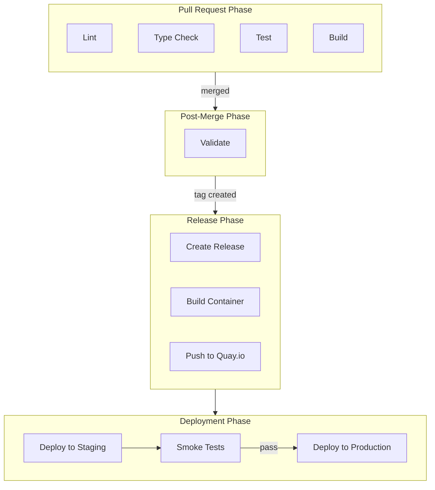

# CI/CD Pipeline

> Continuous integration and deployment workflows for the Portal application

## Table of Contents

1. [Overview](#overview)
2. [Workflows](#workflows)
3. [Pipeline Architecture](#pipeline-architecture)
4. [PR Checks](#pr-checks)
5. [Local Testing](#local-testing)
6. [Planned Workflows](#planned-workflows)
7. [Configuration](#configuration)

## Overview

The CI/CD pipeline uses GitHub Actions to automate testing, building, and deployment. Workflows are designed to be composable - the CI workflow can be called by other workflows to avoid duplication.

## Workflows

| Workflow | File | Trigger | Purpose |
|----------|------|---------|---------|
| CI | `ci.yml` | PR to main | Lint, typecheck, test, build |
| Main | `main.yml` | Push to main | Post-merge validation (calls CI) |
| Release | `release.yml` | Tag push (`v*`) | Generate changelog, create GitHub release |
| Build Image | `build-image.yml` | Release published | Build and push to Quay.io |
| Deploy Staging | `deploy-staging.yml` | Build Image completes | Deploy to OpenShift staging, smoke tests |
| Deploy Prod | `deploy-prod.yml` | Manual | Production deployment (planned) |

## Pipeline Architecture



## PR Checks

The CI workflow runs four parallel jobs on every pull request:

### Lint

Runs ESLint to check code style and catch potential issues.

```bash
pnpm lint
```

### Type Check

Runs TypeScript compiler to verify type safety.

```bash
pnpm typecheck
```

### Test

Runs the Vitest test suite.

```bash
pnpm test
```

### Build

Verifies the application builds successfully for production.

```bash
pnpm build
```

### Concurrency

The workflow uses concurrency groups to cancel outdated runs when new commits are pushed to a PR:

```yaml
concurrency:
  group: ci-${{ github.head_ref || github.ref }}
  cancel-in-progress: true
```

## Creating Releases

To create a release, push a version tag:

```bash
# Update version in package.json, then:
git tag v1.0.0
git push origin v1.0.0
```

The release workflow will:
1. Generate a changelog from conventional commits using [git-cliff](https://git-cliff.org)
2. Create a GitHub release with the changelog as the body

Changelog categories are derived from commit prefixes (`feat:`, `fix:`, `docs:`, etc.).

## Local Testing

Workflows can be tested locally using [nektos/act](https://github.com/nektos/act), which runs GitHub Actions in Docker/Podman containers.

### Installation

```bash
# Fedora/RHEL
sudo dnf install act

# macOS
brew install act

# Other platforms: https://nektosact.com/installation/
```

### Usage

```bash
# List jobs for an event
act pull_request --list

# Run all jobs for pull_request event
act pull_request

# Run a specific job
act pull_request -j lint
act pull_request -j typecheck
act pull_request -j test
act pull_request -j build

# Run with verbose output
act pull_request -j lint -v
```

### Podman Configuration

If using Podman instead of Docker, act auto-detects the Podman socket. Ensure the Podman socket is running:

```bash
systemctl --user start podman.socket
```

### Limitations

- Some GitHub Actions features may not work identically in act
- Secrets must be provided via `.secrets` file or `-s` flag
- Caching behavior differs from GitHub-hosted runners

## Planned Workflows

The following workflows are planned for future implementation:

### Production Deployment (`deploy-prod.yml`)

- Triggered manually or by successful staging tests
- Deploys to OpenShift production project
- Requires approval for production changes

## Configuration

### Required Secrets

Configure these secrets in GitHub repository settings:

| Secret | Purpose |
|--------|---------|
| `QUAY_USERNAME` | Quay.io registry username |
| `QUAY_PASSWORD` | Quay.io registry password |
| `OPENSHIFT_SERVER` | OpenShift API server URL |
| `OPENSHIFT_TOKEN` | OpenShift service account token |

### Node.js Version

The CI uses Node.js version specified in `.nvmrc` (currently Node 22 LTS).

### Branch Protection

Recommended branch protection rules for `main`:

- Require pull request reviews
- Require status checks to pass (lint, typecheck, test, build)
- Require branches to be up to date
- Do not allow bypassing the above settings
