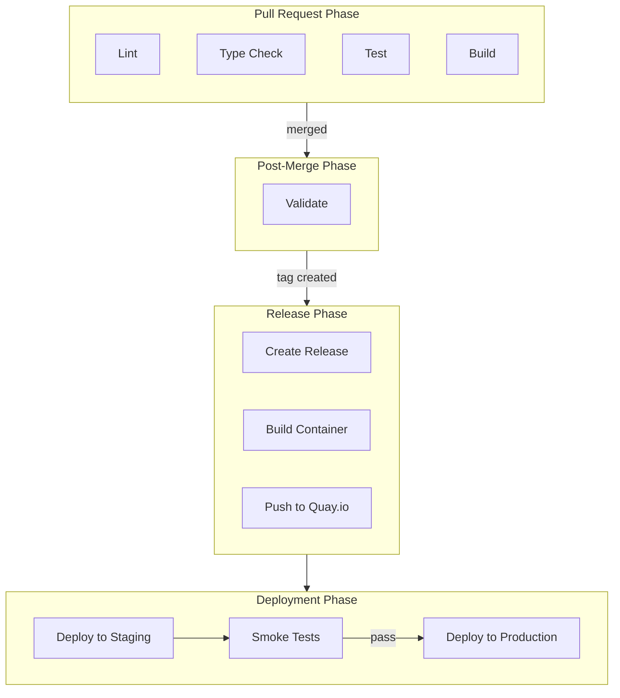

# CI/CD Pipeline

> Continuous integration and deployment workflows for the Portal application

## Table of Contents

1. [Overview](#overview)
2. [Workflows](#workflows)
3. [Pipeline Architecture](#pipeline-architecture)
4. [PR Checks](#pr-checks)
5. [Planned Workflows](#planned-workflows)
6. [Configuration](#configuration)

## Overview

The CI/CD pipeline uses GitHub Actions to automate testing, building, and deployment. Workflows are designed to be composable - the CI workflow can be called by other workflows to avoid duplication.

## Workflows

| Workflow | File | Trigger | Purpose |
|----------|------|---------|---------|
| CI | `ci.yml` | PR to main | Lint, typecheck, test, build |
| Main | `main.yml` | Push to main | Post-merge validation |
| Release | `release.yml` | Tag push | Version and changelog (planned) |
| Build Image | `build-image.yml` | Release | Container build (planned) |
| Deploy Staging | `deploy-staging.yml` | Image push | Staging deployment (planned) |
| Deploy Prod | `deploy-prod.yml` | Manual | Production deployment (planned) |

## Pipeline Architecture



## PR Checks

The CI workflow runs four parallel jobs on every pull request:

### Lint

Runs ESLint to check code style and catch potential issues.

```bash
pnpm lint
```

### Type Check

Runs TypeScript compiler to verify type safety.

```bash
pnpm typecheck
```

### Test

Runs the Vitest test suite.

```bash
pnpm test
```

### Build

Verifies the application builds successfully for production.

```bash
pnpm build
```

### Concurrency

The workflow uses concurrency groups to cancel outdated runs when new commits are pushed to a PR:

```yaml
concurrency:
  group: ci-${{ github.head_ref || github.ref }}
  cancel-in-progress: true
```

## Planned Workflows

The following workflows are planned for future implementation:

### Post-Merge Validation (`main.yml`)

Re-runs all CI checks on merged code to ensure integrity. Can trigger downstream release workflows.

### Release (`release.yml`)

- Triggered by version tags (e.g., `v1.2.3`)
- Generates changelog from conventional commits
- Creates GitHub release with release notes

### Container Build (`build-image.yml`)

- Triggered by release creation
- Builds container image using `Containerfile`
- Pushes to `quay.io/opl/portal`
- Tags with version and `latest`

### Staging Deployment (`deploy-staging.yml`)

- Triggered by image push to registry
- Deploys to OpenShift staging project
- Runs smoke tests against staging environment
- Reports test results

### Production Deployment (`deploy-prod.yml`)

- Triggered manually or by successful staging tests
- Deploys to OpenShift production project
- Requires approval for production changes

## Configuration

### Required Secrets

Configure these secrets in GitHub repository settings:

| Secret | Purpose |
|--------|---------|
| `QUAY_USERNAME` | Quay.io registry username (planned) |
| `QUAY_PASSWORD` | Quay.io registry password (planned) |
| `OPENSHIFT_SERVER` | OpenShift API server URL (planned) |
| `OPENSHIFT_TOKEN` | OpenShift service account token (planned) |

### Node.js Version

The CI uses Node.js version specified in `.nvmrc` (currently Node 22 LTS).

### Branch Protection

Recommended branch protection rules for `main`:

- Require pull request reviews
- Require status checks to pass (lint, typecheck, test, build)
- Require branches to be up to date
- Do not allow bypassing the above settings
