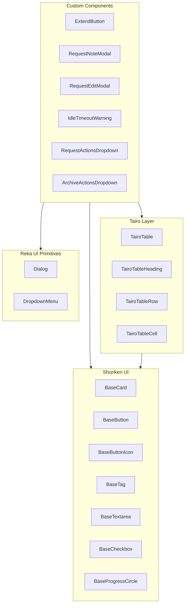
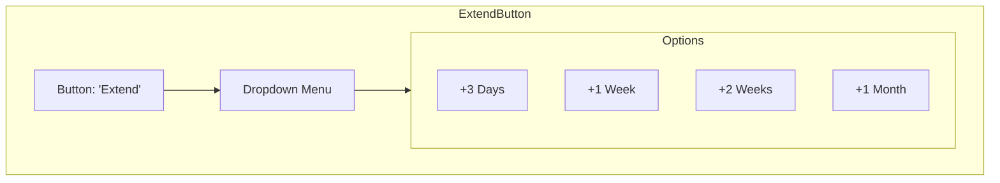

# Components Reference

> Complete documentation for custom components and UI library usage

## Table of Contents

1. [Overview](#overview)
2. [UI Libraries](#ui-libraries)
3. [Custom Components](#custom-components)
4. [Shuriken UI Components](#shuriken-ui-components)
5. [Tairo Components](#tairo-components)
6. [Reka UI Primitives](#reka-ui-primitives)
7. [Icons](#icons)

## Overview

The application uses a layered component architecture:



## UI Libraries

| Library | Purpose | Documentation |
|---------|---------|---------------|
| **Shuriken UI** | Base component library | [shuriken-ui.dev](https://shuriken-ui.dev) |
| **Tairo** | Extended UI layer with layouts | Local in `layers/tairo/` |
| **Reka UI** | Headless UI primitives | [reka-ui.dev](https://reka-ui.dev) |
| **Iconify** | Icon collections | [iconify.design](https://iconify.design) |

## Custom Components

### ExtendButton

A dropdown button for requesting reservation extensions.

**Location:** `app/components/ExtendButton.vue`

**Props:**

| Prop | Type | Default | Description |
|------|------|---------|-------------|
| `loading` | `boolean` | `false` | Shows loading spinner |

**Events:**

| Event | Payload | Description |
|-------|---------|-------------|
| `extend` | `'3d' \| '1w' \| '2w' \| '1mo'` | Emitted when duration selected |

**Usage:**

```vue
<template>
  <ExtendButton
    :loading="extending"
    @extend="handleExtend"
  />
</template>

<script setup>
const extending = ref(false)

const handleExtend = async (duration) => {
  extending.value = true
  try {
    await extendRequest(requestId, duration)
  } finally {
    extending.value = false
  }
}
</script>
```

**Visual Structure:**



---

### RequestNoteModal

A dialog for adding notes to requests.

**Location:** `app/components/RequestNoteModal.vue`

**Props:**

| Prop | Type | Default | Description |
|------|------|---------|-------------|
| `requestId` | `number \| null` | Required | Target request ID |
| `forceImmutable` | `boolean` | `false` | Force notes to be immutable |

**Models:**

| Model | Type | Description |
|-------|------|-------------|
| `open` | `boolean` | Controls dialog visibility |

**Usage:**

```vue
<template>
  <RequestNoteModal
    v-model:open="noteModalOpen"
    :request-id="selectedRequestId"
  />
</template>

<script setup>
const noteModalOpen = ref(false)
const selectedRequestId = ref<number | null>(null)

const openNoteModal = (id: number) => {
  selectedRequestId.value = id
  noteModalOpen.value = true
}
</script>
```

**Features:**
- Text area for note content
- Checkbox to make note immutable
- Automatic form reset on close
- Error handling with display
- Loading state during submission

---

### RequestEditModal

A dialog for editing request details (admin only).

**Location:** `app/components/RequestEditModal.vue`

**Props:**

| Prop | Type | Default | Description |
|------|------|---------|-------------|
| `requestId` | `number \| null` | Required | Target request ID |

**Models:**

| Model | Type | Description |
|-------|------|-------------|
| `open` | `boolean` | Controls dialog visibility |

**Events:**

| Event | Payload | Description |
|-------|---------|-------------|
| `updated` | - | Emitted when changes are saved |

**Usage:**

```vue
<template>
  <RequestEditModal
    v-model:open="editModalOpen"
    :request-id="selectedRequestId"
    @updated="handleUpdated"
  />
</template>

<script setup>
const editModalOpen = ref(false)
const selectedRequestId = ref<number | null>(null)

const handleUpdated = () => {
  refresh() // Reload data after edit
}
</script>
```

**Features:**
- Status dropdown (Pending, Approved, Denied, Completed)
- Timezone selector (20+ IANA timezones)
- Notes editing with immutable locking
- Batch save for all changes

**Editable Fields:**
- Status
- Timezone
- Individual notes (if not immutable)
- Note immutability flag

---

### IdleTimeoutWarning

A dialog shown when the session is about to expire.

**Location:** `app/components/IdleTimeoutWarning.vue`

**Props:**

| Prop | Type | Default | Description |
|------|------|---------|-------------|
| `open` | `boolean` | Required | Controls visibility |
| `secondsRemaining` | `number` | Required | Countdown seconds |

**Events:**

| Event | Payload | Description |
|-------|---------|-------------|
| `stayLoggedIn` | - | User wants to stay logged in |

**Usage:**

```vue
<template>
  <IdleTimeoutWarning
    :open="isWarningVisible"
    :seconds-remaining="secondsRemaining"
    @stay-logged-in="stayLoggedIn"
  />
</template>

<script setup>
const {
  isWarningVisible,
  secondsRemaining,
  stayLoggedIn
} = useIdleTimeout({
  timeout: 10 * 60 * 1000, // 10 minutes
  warningTime: 60 * 1000   // 1 minute warning
})
</script>
```

**Behavior:**
- Cannot be dismissed by clicking outside
- Cannot be closed with Escape key
- Countdown updates every second
- "Stay Logged In" resets the timeout

---

### RequestActionsDropdown

A dropdown menu with actions for active requests.

**Location:** `app/components/RequestActionsDropdown.vue`

**Props:**

| Prop | Type | Default | Description |
|------|------|---------|-------------|
| `requestId` | `number` | Required | Target request ID |

**Events:**

| Event | Payload | Description |
|-------|---------|-------------|
| `extend` | `'3d' \| '1w' \| '2w' \| '1mo'` | Extension requested |
| `createNote` | - | Note creation requested |

**Actions:**
- View Details - navigates to request page
- Extend (submenu) - +1 Week, +2 Weeks, +1 Month
- Create Note - opens note modal

---

### ArchiveActionsDropdown

A simplified dropdown for archived requests.

**Location:** `app/components/ArchiveActionsDropdown.vue`

**Props:**

| Prop | Type | Default | Description |
|------|------|---------|-------------|
| `requestId` | `number` | Required | Target request ID |

**Events:**

| Event | Payload | Description |
|-------|---------|-------------|
| `createNote` | - | Note creation requested |

**Actions:**
- View Details - navigates to request page (with `?from=archive`)
- Create Note - opens note modal

---

## Shuriken UI Components

### BaseCard

Container with rounded corners and shadow.

```vue
<BaseCard rounded="lg" class="p-5">
  Content here
</BaseCard>
```

**Props:**

| Prop | Values | Default |
|------|--------|---------|
| `rounded` | `'none' \| 'sm' \| 'md' \| 'lg' \| 'full'` | `'md'` |

---

### BaseButton

Primary button component.

```vue
<BaseButton
  variant="primary"
  color="primary"
  size="md"
  rounded="lg"
  :loading="isLoading"
  :disabled="isDisabled"
>
  Click Me
</BaseButton>
```

**Props:**

| Prop | Values | Default |
|------|--------|---------|
| `variant` | `'solid' \| 'outline' \| 'ghost' \| 'default'` | `'solid'` |
| `color` | `'primary' \| 'muted' \| 'danger' \| 'warning' \| 'success' \| 'info'` | `'primary'` |
| `size` | `'xs' \| 'sm' \| 'md' \| 'lg' \| 'xl'` | `'md'` |
| `rounded` | `'none' \| 'sm' \| 'md' \| 'lg' \| 'full'` | `'md'` |
| `loading` | `boolean` | `false` |
| `disabled` | `boolean` | `false` |

---

### BaseButtonIcon

Icon-only button.

```vue
<BaseButtonIcon size="sm" rounded="lg">
  <Icon name="lucide:more-horizontal" class="size-4" />
</BaseButtonIcon>
```

---

### BaseTag

Label/badge component.

```vue
<BaseTag
  variant="solid"
  color="primary"
  rounded="full"
  size="sm"
>
  Running
</BaseTag>
```

**Props:**

| Prop | Values | Default |
|------|--------|---------|
| `variant` | `'solid' \| 'outline' \| 'none'` | `'solid'` |
| `color` | `'primary' \| 'muted' \| 'danger' \| 'warning' \| 'success' \| 'info'` | `'primary'` |
| `rounded` | `'none' \| 'sm' \| 'md' \| 'lg' \| 'full'` | `'md'` |
| `size` | `'sm' \| 'md'` | `'md'` |

---

### BaseTextarea

Multi-line text input.

```vue
<BaseTextarea
  v-model="content"
  placeholder="Enter text..."
  :rows="4"
  :disabled="false"
/>
```

---

### BaseCheckbox

Checkbox input.

```vue
<BaseCheckbox
  v-model="isChecked"
  color="primary"
  label="Accept terms"
  :disabled="false"
/>
```

---

### BaseProgressCircle

Circular progress indicator.

```vue
<BaseProgressCircle
  :model-value="75"
  :size="40"
  :thickness="3"
/>
```

**Props:**

| Prop | Type | Default | Description |
|------|------|---------|-------------|
| `modelValue` | `number` | `0` | Progress 0-100 |
| `size` | `number` | `60` | Diameter in pixels |
| `thickness` | `number` | `4` | Stroke width |

---

## Tairo Components

### TairoTable

Styled table wrapper.

```vue
<TairoTable rounded="lg">
  <template #header>
    <TairoTableHeading uppercase>Column Name</TairoTableHeading>
  </template>

  <TairoTableRow v-for="item in items" :key="item.id">
    <TairoTableCell spaced>
      {{ item.value }}
    </TairoTableCell>
  </TairoTableRow>
</TairoTable>
```

### TairoTableHeading

Table header cell.

**Props:**

| Prop | Type | Default | Description |
|------|------|---------|-------------|
| `uppercase` | `boolean` | `false` | Uppercase text |

### TairoTableRow

Table row wrapper.

### TairoTableCell

Table data cell.

**Props:**

| Prop | Type | Default | Description |
|------|------|---------|-------------|
| `spaced` | `boolean` | `false` | Add padding |
| `light` | `boolean` | `false` | Lighter text color |

---

## Reka UI Primitives

The application uses Reka UI for headless, accessible UI primitives.

### Dialog

Used for modal dialogs.

```vue
<script setup>
import {
  DialogRoot,
  DialogPortal,
  DialogOverlay,
  DialogContent,
  DialogTitle,
  DialogDescription,
  DialogClose,
} from 'reka-ui'
</script>

<template>
  <DialogRoot v-model:open="isOpen">
    <DialogPortal>
      <DialogOverlay class="fixed inset-0 bg-black/50" />
      <DialogContent class="fixed center">
        <DialogTitle>Title</DialogTitle>
        <DialogDescription>Description</DialogDescription>
        <DialogClose>Close</DialogClose>
      </DialogContent>
    </DialogPortal>
  </DialogRoot>
</template>
```

### DropdownMenu

Used for dropdown menus.

```vue
<script setup>
import {
  DropdownMenuRoot,
  DropdownMenuTrigger,
  DropdownMenuPortal,
  DropdownMenuContent,
  DropdownMenuItem,
  DropdownMenuSeparator,
  DropdownMenuSub,
  DropdownMenuSubTrigger,
  DropdownMenuSubContent,
} from 'reka-ui'
</script>

<template>
  <DropdownMenuRoot>
    <DropdownMenuTrigger as-child>
      <button>Open</button>
    </DropdownMenuTrigger>

    <DropdownMenuPortal>
      <DropdownMenuContent>
        <DropdownMenuItem @click="action1">Item 1</DropdownMenuItem>
        <DropdownMenuSeparator />
        <DropdownMenuItem @click="action2">Item 2</DropdownMenuItem>
      </DropdownMenuContent>
    </DropdownMenuPortal>
  </DropdownMenuRoot>
</template>
```

---

## Icons

The application uses Iconify with multiple icon sets.

### Available Icon Sets

| Set | Prefix | Examples |
|-----|--------|----------|
| Phosphor (duotone) | `ph:` | `ph:flask-duotone`, `ph:check-circle-duotone` |
| Lucide | `lucide:` | `lucide:x`, `lucide:calendar-plus` |

### Usage

```vue
<template>
  <!-- Phosphor duotone -->
  <Icon name="ph:flask-duotone" class="size-6" />

  <!-- Lucide -->
  <Icon name="lucide:calendar-plus" class="size-4" />

  <!-- With color -->
  <Icon name="ph:check-circle-duotone" class="size-5 text-emerald-500" />

  <!-- Spinning -->
  <Icon name="ph:spinner" class="size-4 animate-spin" />
</template>
```

### Commonly Used Icons

| Icon | Name | Usage |
|------|------|-------|
| Flask | `ph:flask-duotone` | Labs |
| Play | `ph:play-circle-duotone` | Active |
| Prohibit | `ph:prohibit-duotone` | Denied |
| Check | `ph:check-circle-duotone` | Completed |
| Cube | `ph:cube-duotone` | Cluster |
| Clock | `ph:clock-duotone` | Time |
| Spinner | `ph:spinner` | Loading |
| Calendar Plus | `lucide:calendar-plus` | Extend |
| Message Plus | `lucide:message-square-plus` | Note |
| X | `lucide:x` | Close |
| Eye | `lucide:eye` | View |
| Pencil | `lucide:pencil` | Edit |
| Lock | `lucide:lock` | Immutable |
| Chevrons | `lucide:chevron-left/right` | Navigation |

---

## Animation Classes

Custom animations defined in component styles:

```css
/* Fade animations */
.animate-fade-in {
  animation: fade-in 150ms ease-out;
}

.animate-fade-out {
  animation: fade-out 150ms ease-in;
}

/* Scale animations (for modals) */
.animate-scale-in {
  animation: scale-in 150ms ease-out;
}

.animate-scale-out {
  animation: scale-out 150ms ease-in;
}

/* Spin animation (for loading) */
.animate-spin {
  animation: spin 1s linear infinite;
}
```

---

**Related Documentation**:
- [Developer Guide](developer-guide.md) - Development setup
- [User Guide](user-guide.md) - User documentation
- [Styling Guide in Developer Guide](developer-guide.md#styling-guide) - CSS conventions
