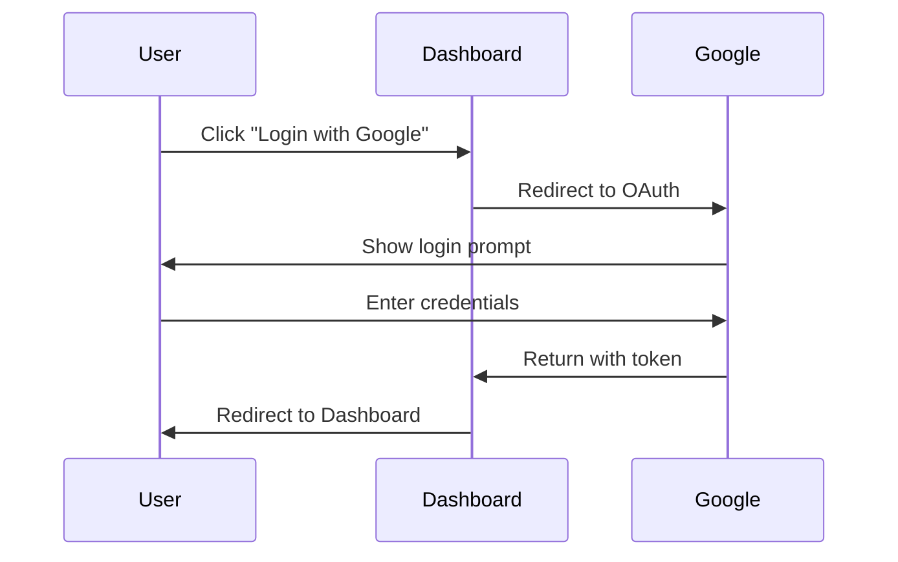
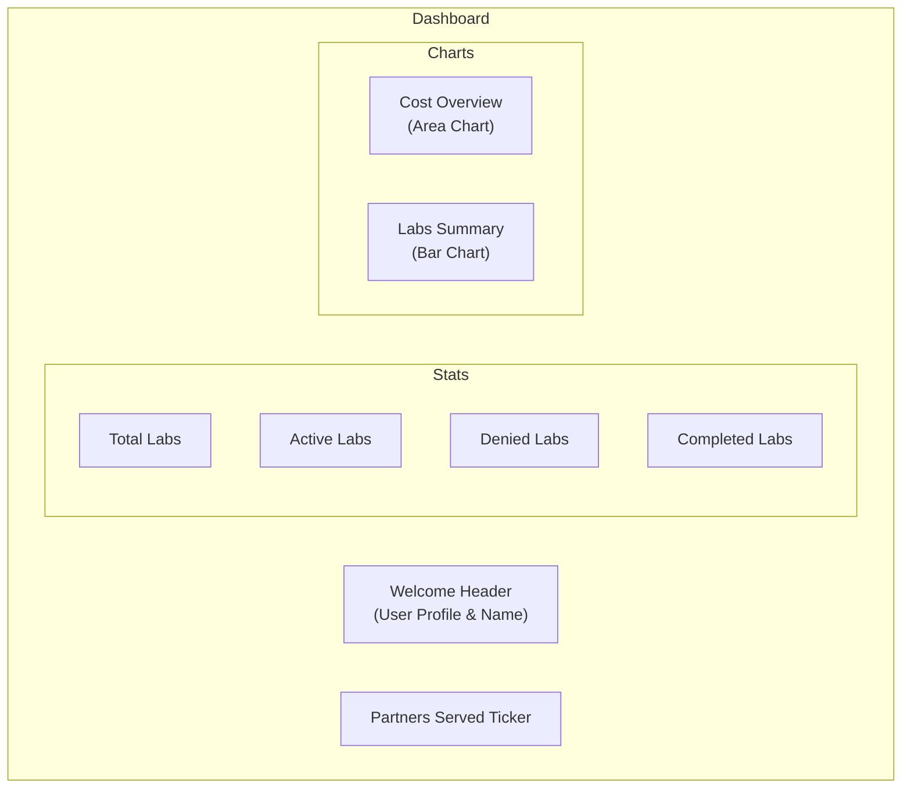
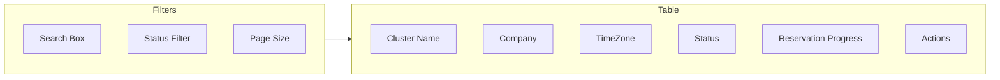
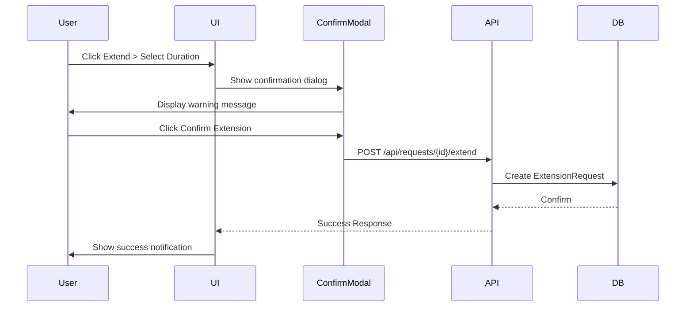
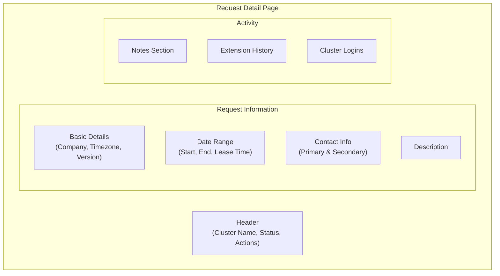
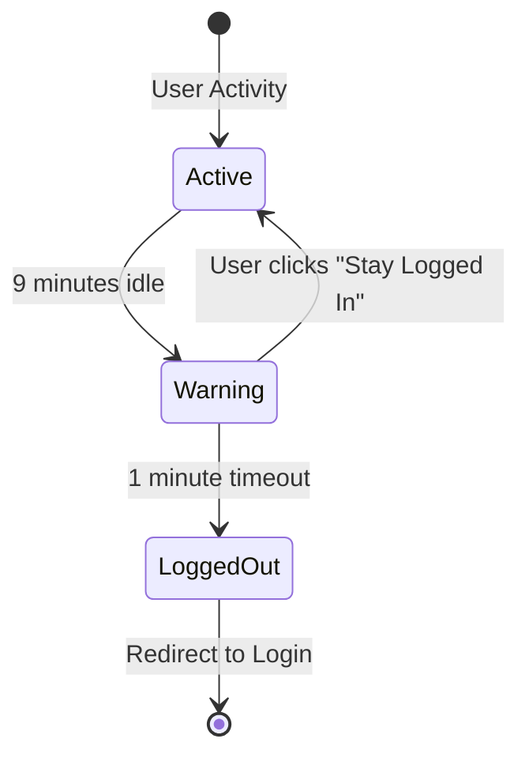

# User Guide

> Complete guide to using the OpenShift Partner Labs Dashboard

## Table of Contents

1. [Getting Started](#getting-started)
2. [Authentication](#authentication)
3. [Dashboard Overview](#dashboard-overview)
4. [Managing Requests](#managing-requests)
5. [Request Details](#request-details)
6. [Archive](#archive)
7. [Company View](#company-view)
8. [Session Management](#session-management)

## Getting Started

The OpenShift Partner Labs Dashboard provides a centralized interface for managing cluster reservation requests across partner organizations. The application supports multiple languages and offers both light and dark themes.

### Supported Languages

- English (en)
- French (fr)
- Spanish (es)
- German (de)
- Arabic (ar) - RTL support
- Japanese (ja)

## Authentication

The dashboard uses Google OAuth for secure authentication.

### Logging In

1. Navigate to the application URL
2. Click the **"Login with Google"** button
3. Select your Google account
4. Grant the requested permissions
5. You'll be automatically redirected to the dashboard

### Logging Out

1. Click on your profile avatar in the navigation
2. Select **"Logout"**
3. You'll be redirected to the login page

## Dashboard Overview

The dashboard provides a comprehensive view of lab statistics and activity.

### Stat Cards

The dashboard displays four key metrics as clickable stat cards:

| Card | Description | Click Action |
|------|-------------|--------------|
| **Total Labs** | Total number of lab requests | Navigate to all requests |
| **Active Labs** | Labs in Running or Hibernating state | Navigate to active requests |
| **Denied Labs** | Requests that were denied | Navigate to denied archive |
| **Completed Labs** | Labs that have been completed | Navigate to completed archive |

### Cost Overview Chart

The area chart displays cost data comparing current year vs previous year:

- **This Year** (Blue) - Current year's monthly costs
- **Last Year** (Purple) - Previous year's monthly costs
- **Cost/Lab** - Calculated average cost per active lab

### Labs Summary Chart

The bar chart shows lab creation and completion trends:

- **Created** (Blue) - Labs created per month
- **Completed** (Green) - Labs completed per month

### Partners Served

An auto-scrolling ticker displays all partner companies that have been served. Hover to pause the animation.

## Managing Requests

### Request List View

Navigate to **Requests** in the main navigation to view all active reservation requests.

### Search and Filter

- **Search Box**: Search by cluster name, company, timezone, or status
- **Status Filter**: Filter by active (Running/Hibernating) requests
- **Page Size**: Choose 10, 25, 50, or 100 entries per page

### Request Statuses

| Status | Description | Color |
|--------|-------------|-------|
| **Pending** | Awaiting approval | Amber |
| **Approved** | Approved, awaiting provisioning | Green |
| **Running** | Active and operational | Blue |
| **Hibernating** | Suspended to save costs | Gray |
| **Denied** | Request was rejected | Red |
| **Completed** | Lab lifecycle finished | Green |

### Reservation Progress

Each request shows a circular progress indicator displaying:
- Visual percentage complete
- Elapsed percentage of the reservation period

### Available Actions

#### Extend Request

Request an extension for a running lab:

1. Click the **Extend** dropdown button
2. Select duration:
   - 3 Days
   - 1 Week
   - 2 Weeks
   - 1 Month
3. A confirmation dialog appears with a warning message
4. Review the message reminding you to discuss with a manager
5. Click **Confirm Extension** to submit or **Cancel** to abort
6. The extension request is submitted for approval

**Important:** The confirmation dialog reminds users to discuss extensions with lab managers before proceeding. This helps ensure proper approval workflows are followed.

#### Add Note

Add notes to any request:

1. Click the **Note** button
2. Enter your note content
3. Click **Save**

Notes are displayed in the request detail view with:
- Author name and avatar
- Creation timestamp
- Immutable indicator (if applicable)

#### Edit Request (Admin Only)

Users with edit permissions can modify request details:

1. Click the **Edit** button
2. Update fields in the modal
3. Click **Save**

## Request Details

Click on any cluster name to view the full request details.

### Information Displayed

### Basic Details

- **Company**: Partner organization name
- **OpenShift Version**: Cluster version deployed
- **Request Type**: Type of lab request
- **Sponsor**: Internal sponsor
- **Timezone**: Cluster timezone
- **Reservation**: Progress indicator

### Contact Information

Primary and secondary contacts with:
- Full name
- Email address (clickable mailto link)

### Notes Section

View all notes associated with the request:
- Chronologically ordered
- Author attribution
- System notes marked as immutable

### Extension History

View all extension requests:
- Requested duration
- Requester name
- Request date
- Approval status

### Cluster Logins

Track cluster access:
- Login name
- Login type
- Access timestamp

## Archive

The Archive page displays completed and denied requests.

### Accessing the Archive

1. Click **Archive** in the main navigation
2. Or click **Denied Labs** or **Completed Labs** on the dashboard

### Filtering Archived Requests

- Use the status filter to show only Denied or Completed
- Use the search box to find specific requests
- Adjust page size for larger datasets

### Available Actions

- **View Details**: Click cluster name to see full details
- **Add Note**: Add post-completion notes for record-keeping

## Company View

View all requests for a specific company.

### Accessing Company Requests

1. Click on any company name in the request table
2. You'll be directed to `/companies/{id}/requests`

### Features

- View all requests from a single partner
- Same search and filter capabilities as main requests page
- Extend and note actions available

## Session Management

### Idle Timeout

The application includes an idle timeout feature for security:

- **Timeout Period**: 10 minutes of inactivity
- **Warning**: Shown at 9 minutes (1 minute before logout)
- **Stay Logged In**: Click to reset the timer

### Warning Dialog

When the warning appears:
- Shows countdown timer
- **Stay Logged In** button resets session
- Auto-logout occurs when timer reaches zero

## Keyboard Shortcuts

| Shortcut | Action |
|----------|--------|
| `r` | Refresh current data |
| `Escape` | Close modal dialogs |

## Tips and Best Practices

### For Managers

1. **Review dashboard daily** - Monitor active labs and cost trends
2. **Use filters effectively** - Narrow down requests by status
3. **Add notes liberally** - Document decisions and communications

### For Users

1. **Request extensions early** - Submit before current period expires
2. **Provide complete information** - Include all relevant details in notes
3. **Check timezone settings** - Ensure dates display correctly for your region

## Troubleshooting

### Common Issues

| Issue | Solution |
|-------|----------|
| Can't log in | Clear browser cookies, try again |
| Data not loading | Click Refresh button, check connection |
| Extension not showing | Refresh the page after submission |
| Session expired | Log in again |

### Getting Help

If you encounter issues not covered here:
1. Check with your system administrator
2. Review error messages for specific guidance
3. Contact support with reproduction steps

---

**Next**: Read [Developer Guide](developer-guide.md) for technical documentation
